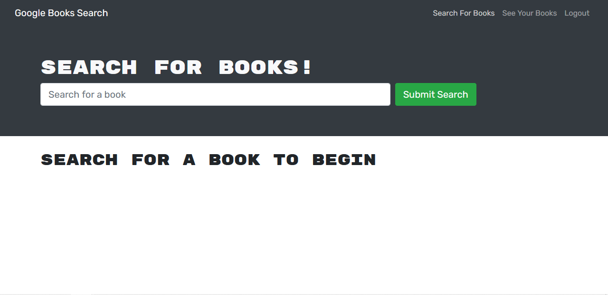
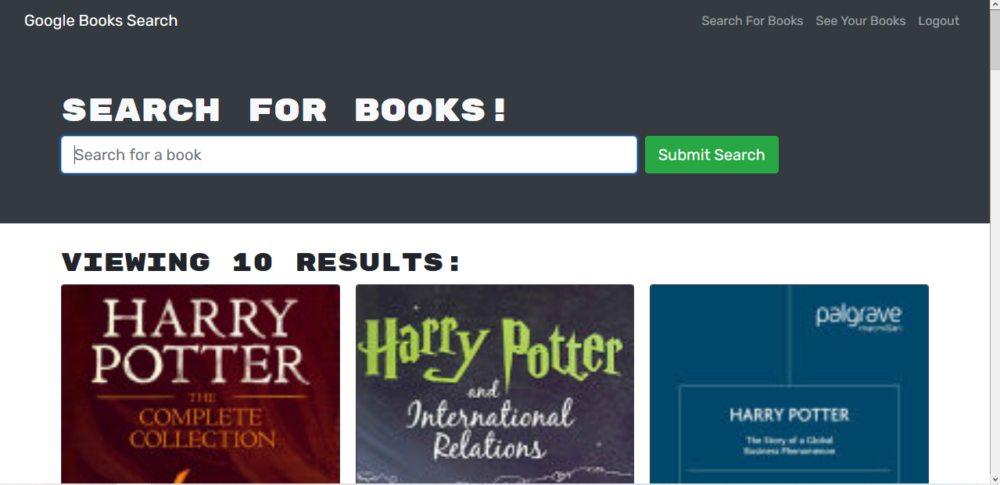
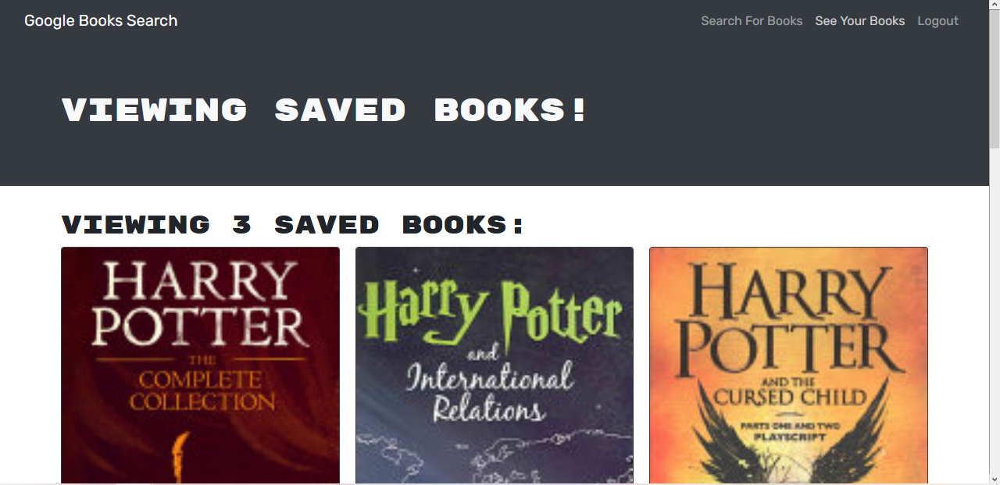
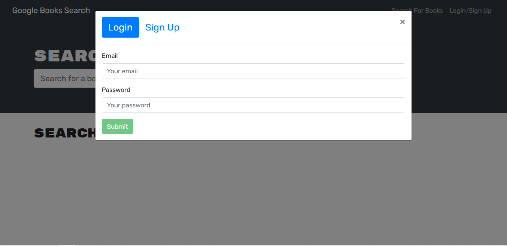
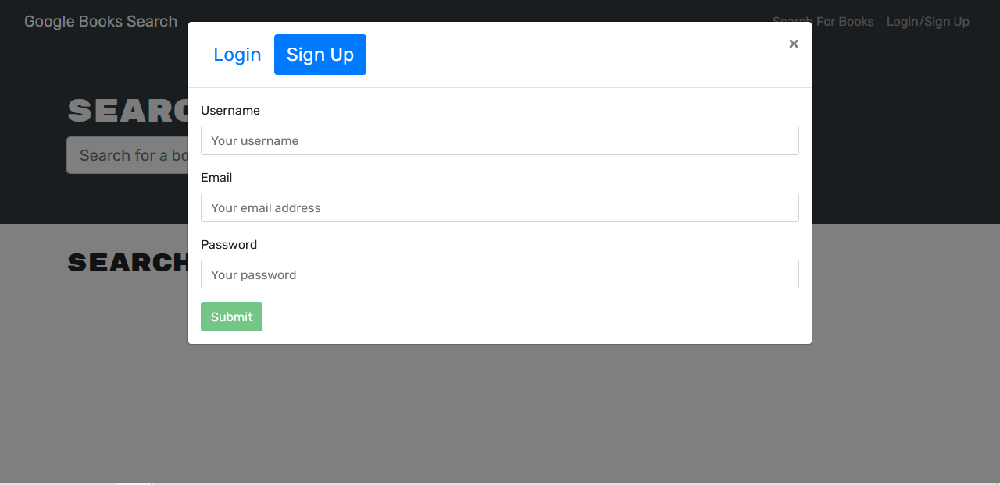

# Book Search Engine
Web application built in react that uses the google books api to allow you to search through a library of books.

## Features
* Has a login and sign up system implemented.
* Allows logged-in users to save books they are interested in.
* Allows logged-in users to remove books they've previously saved.
* Keeps track of saved and removed books for logged-in users.

## Potential Future Upgrades
* Change tracking of already saved and removed books to get the information from graphql instead of using localstorage. (Loses that tracked information on clearing cache and unintentionally carries over to other users.)
* Add a category that allows you to mark books as read, reading, or interested in reading.
* Improve UI for pages.

## Screenshot

## Website
https://aqueous-lowlands-35520.herokuapp.com